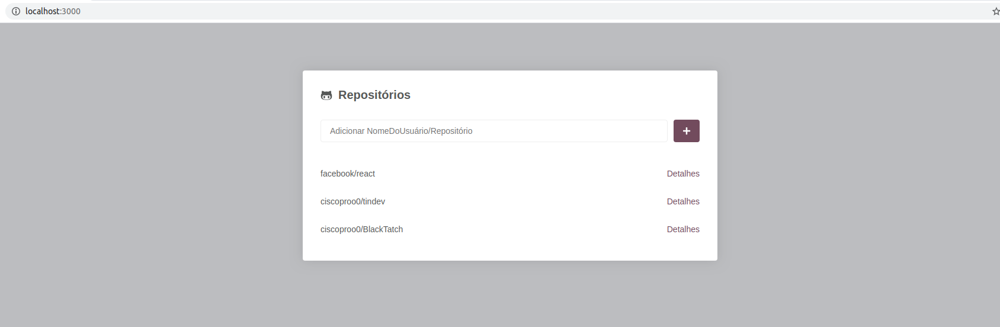
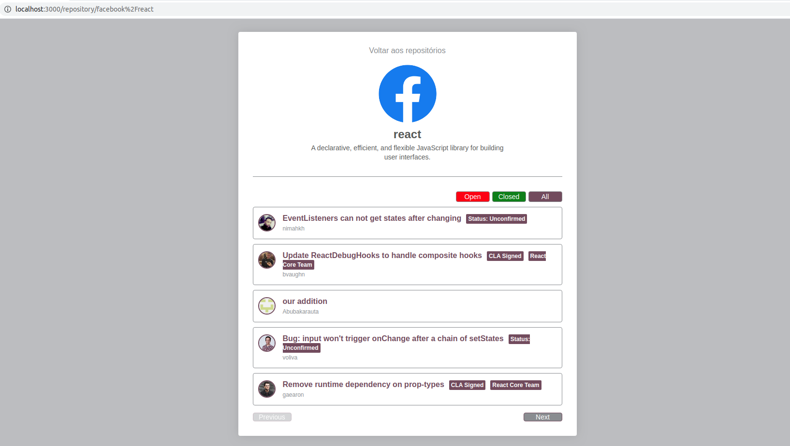

# Github Repository and Issue Lister

---
### An interface to add repositories and list issues from each repository.

For this project, it was used some key concepts from ReactJS such as BrowserRouter, Switch and Route for navigation, api calls using Axios, Component State, some lifecycle component methods (componentDidMount, componentDidUpdate) and Styled Components for CSS. The info is stored in browser storage.

App structure:

- App
    - Container (holds main CSS)
      - Main
      - Repository


#### Here is images from project

###### Main Page



###### Issues Page



---

#### Try it for yourself

clone the project and run using Yarn:

Download all dependencies:

```bash
yarn
```
Run the project
```bash
yarn dev
```
or NPM

Download all dependencies
```bash
npm install
```
Run the project
```bash
npm run dev
```

---

Francisco Silva / francisco.prosilva@gmail.com
